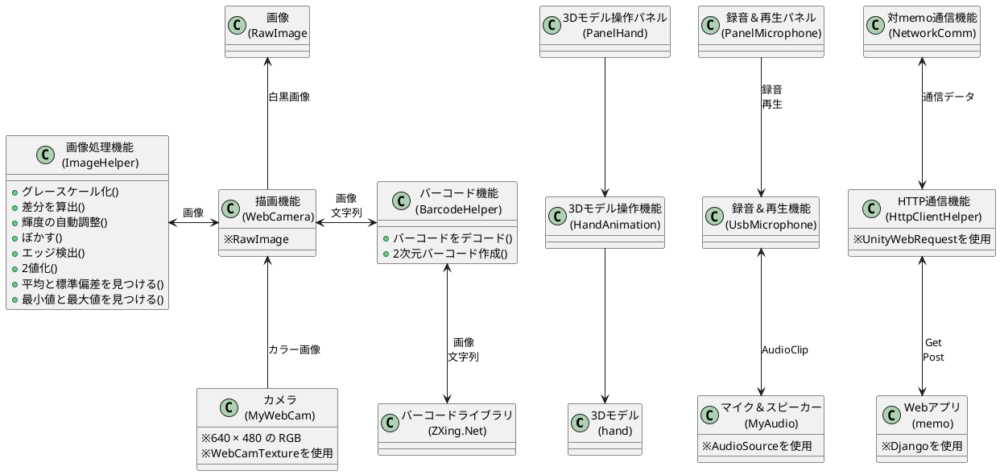

@import "doc.less"

# TheHand

## 概要設計

3Dモデルをスクリプトで動かして遊ぼうと思っ始めていたら、いつの間にかいろいろな機能の動作確認になってしまった・・・

### 機能構造＆データフロー

### 画像処理

- Unity向けのOpenCVが有料のアセットだったので画像処理の動作確認用のコードを実装
  - 本格的に何かを作る段階になったならアセットの購入を検討する

### バーコード

- チェックボックスをONにしたときに動作
  - カメラで移したバーコードのデコード結果を表示
  - 固定の文字列で2次元バーコードを生成して表示

### 3Dモデル操作

- ボーンをスクリプトで稼働
- ボーン毎に初期位置からの角度を指定すると指定した位置へ移動するスクリプトを作成
- 3Dモデルが手抜き過ぎていまいちな動き
  - ボーンの向きがそろってない
  - 関節を曲げるとモデルが潰れる(頂点の数を調整したり、補助ボーンを入れたりするらしい)
  - 一定角度を超えると元に戻らなくなる(ガクガクするのでどこかが干渉していそう)

### 録音＆再生機能

- チェックボックスをONにしている状態で録音
  - 録音時間は1秒(チェックを外す1秒前～の音が録音される)
- ボタンを押すと録音した音を再生

### HTTP通信

- Getでテキストファイルの中身を表示するページを取得
- Postでテキストファイルの中身を書き換え
  - 一回GetしてからでなければPostできない(DjangoではPostにCSRFトークンが必要)

## ライブラリをUnityプロジェクトに追加

- ZXing
  1. 「https://github.com/micjahn/ZXing.Net」からファイルを取得
  2. 「zxing.unity.dll」を「Assets\Plugins」に置く
